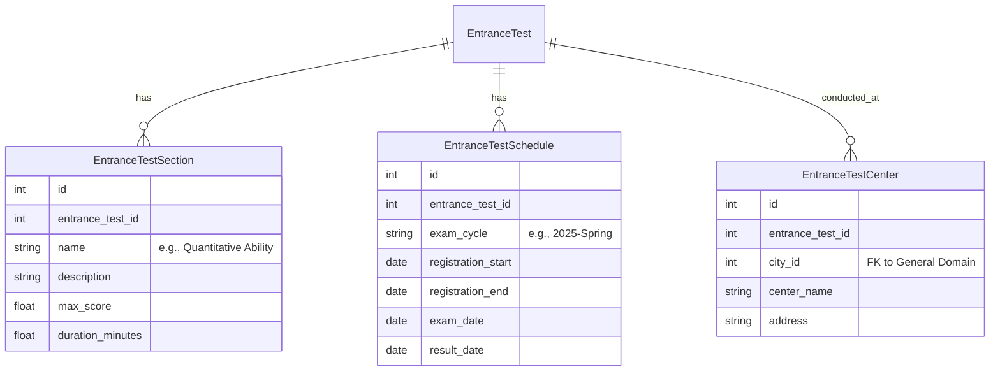
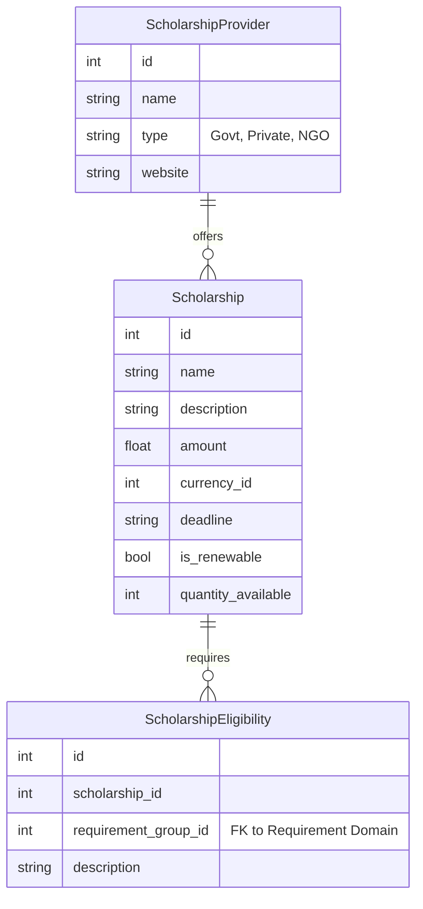
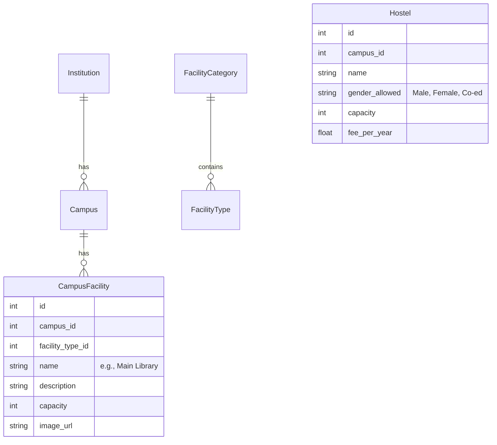

# API Implementation Plan - New Domains

## Goal Description
Design and implement the data models and APIs for **Entrance Exams** (extended), **Scholarships**, and **Infrastructure**.

## User Review Required
> [!IMPORTANT]
> **Entrance Exams Refactoring**: I propose moving existing `EntranceTest` model from `academics.py` to a new `entrance_exam.py` module for better domain isolation. This will require updating existing references.

## 1. Entrance Exams Domain
**Goal**: Expand the existing simple test definition to include structure, scheduling, and centers.
**Effort Estimate**: Medium (due to refactoring and relationships)

### Proposed Schema

### Changes
#### [NEW] [models/entrance_exam.py](file:///c:/Users/Atul/OneDrive/Personal/4_My_Development_Projects/1_CARRMOS/CDM_DCtool/server/app/models/entrance_exam.py)
- Move `EntranceTest` here.
- Add `EntranceTestSection`, `EntranceTestSchedule`, `EntranceTestCenter`.

## 2. Scholarships Domain
**Goal**: Create a system to track financial aid opportunities, linked to eligibility criteria.
**Effort Estimate**: Medium

### Proposed Schema

### Changes
#### [NEW] [models/scholarship.py](file:///c:/Users/Atul/OneDrive/Personal/4_My_Development_Projects/1_CARRMOS/CDM_DCtool/server/app/models/scholarship.py)
- `Scholarship`, `ScholarshipProvider`, `ScholarshipEligibility`.

## 3. Infrastructure Domain
**Goal**: Detail the physical and digital facilities of institutions.
**Effort Estimate**: High (Many entity types linked to Institution)

### Proposed Schema

### Changes
#### [NEW] [models/infrastructure.py](file:///c:/Users/Atul/OneDrive/Personal/4_My_Development_Projects/1_CARRMOS/CDM_DCtool/server/app/models/infrastructure.py)
- `Campus` (linked to `Institution`)
- `FacilityCategory` (e.g., "Sports", "Labs")
- `FacilityType` (e.g., "Swimming Pool", "Chemistry Lab")
- `CampusFacility` (The actual instance)
- `Hostel`

## Implementation Steps (For each domain)
1.  **Create Models**: Define SQLAlchemy models.
2.  **Create Schemas**: Define Pydantic schemas (Create, Update, Response).
3.  **Create CRUD**: Implement utility functions.
4.  **Create Router**: Define API endpoints.
5.  **Verify**: Write and run tests.
